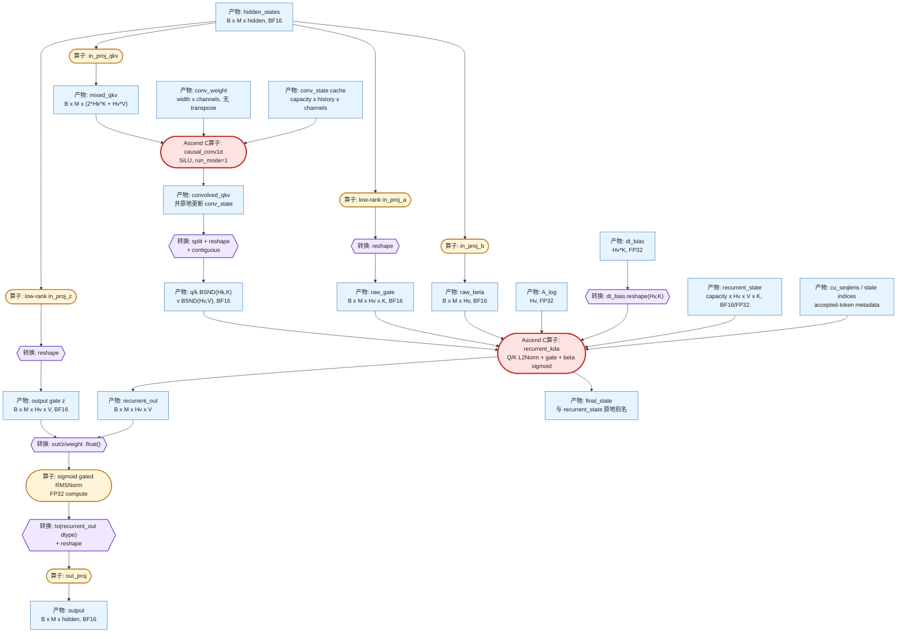
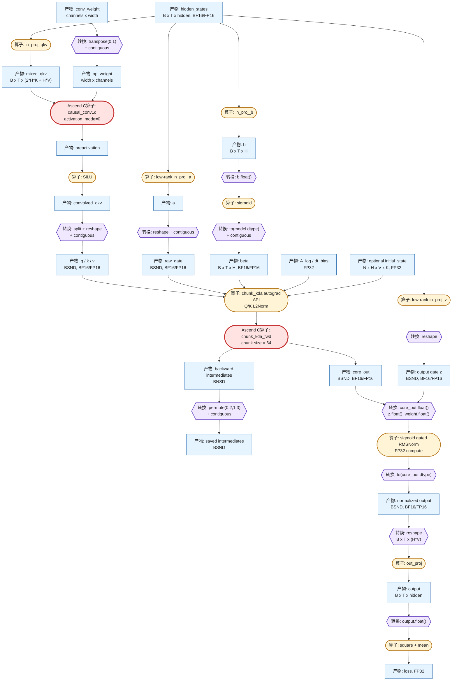
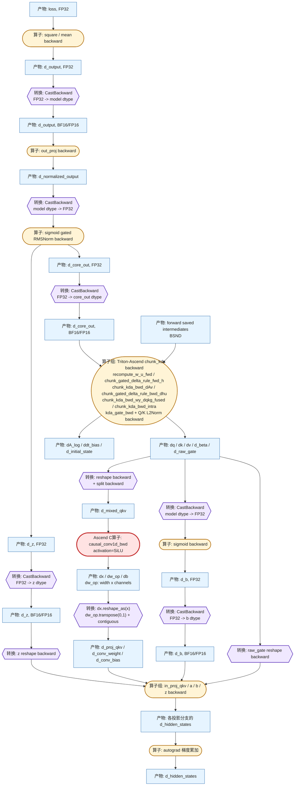
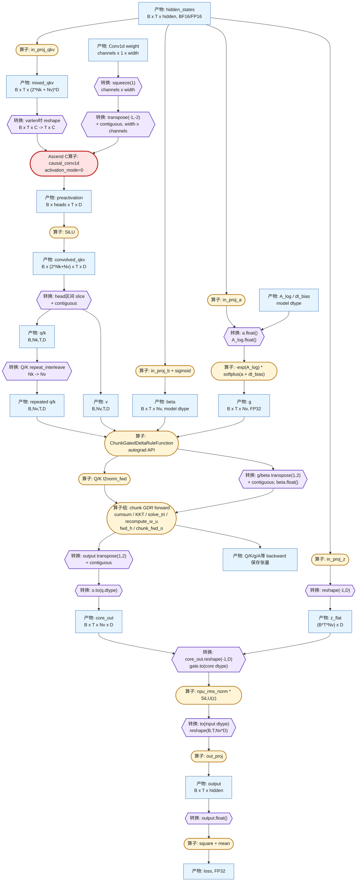
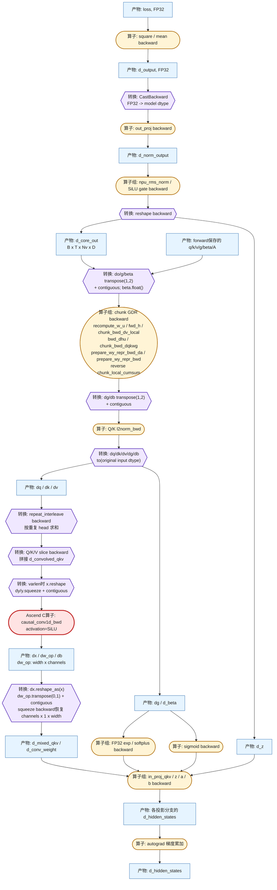
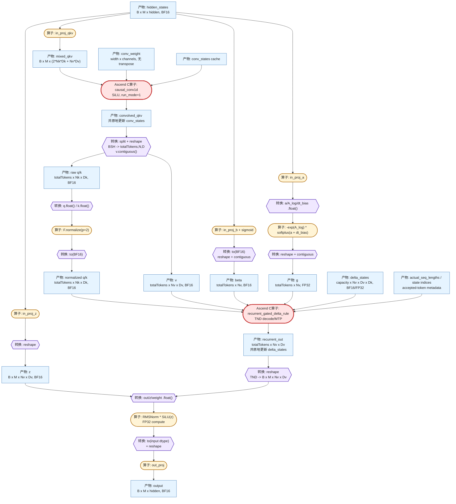

## 简介

> 说明：

> - 关于AI Core的介绍请参见[《Ascend C算子开发》](https://hiascend.com/document/redirect/CannCommunityOpdevAscendC)中“概念原理和术语 > 硬件架构与数据处理原理”。

本项目提供了AI Core算子的开发和调用样例，请开发者根据实际情况参考对应实现。

## 目录说明

```
├── example                       
│   ├── add_example                # AI Core算子名
│   │   ├── CMakeLists.txt         # 算子编译配置文件，保留原文件即可   
│   │   ├── examples               # 算子使用示例
│   │   ├── op_graph               # 算子构图相关目录
│   │   ├── op_host                # 算子信息库、Tiling、InferShape相关实现
│   │   └── op_kernel              # 算子kernel目录
│   ├── mc2                        # 通算融合类算子示例
│   │   ├── all_gather_add         # AI Core算子名
│   │   │   └── ...              
│   ├── CMakeLists.txt             # 算子编译配置文件，保留原文件即可
│   └── README.md                  # 算子说明文档

```

## 完整 Recurrent KDA 层样例

`recurrent_kda_layer.py` 是面向 decode/MTP 的完整 KDA mixer 示例。它在
`recurrent_kda` 外增加模型层需要的投影、短卷积、输出门控和归一化。该示例不包含
Transformer Block 外层的 pre-norm、残差和 MLP。Q/K/V 输入路径与
`flash_gated_delta_rule.py` 对齐：先生成拼接 QKV，再通过一次 depthwise
`causal_conv1d`，最后拆分为三路。

架构如下。节点颜色和形状沿用后文 KDA 训练图的约定：蓝色矩形是计算产物，黄色
圆角节点是普通算子，紫色六边形是布局或 dtype 转换，红色圆角节点是仓库
Ascend C 算子。



该脚本由 `@torch.no_grad()` 和外层 `torch.inference_mode()` 驱动，只包含前向和
状态原地更新。卷积权重初始化时已经是 `width x channels`，recurrent state 也直接
采用 V-first 的 `capacity x Hv x V x K` 布局，因此 Python 路径没有额外
`transpose`。

调用流程：

1. `in_proj_qkv` 生成拼接 QKV；启用短卷积时，通过一次仓库 `causal_conv1d`
   同时处理全部 depthwise 通道并原地更新统一卷积缓存，随后拆分 Q/K/V；关闭时对
   拼接张量直接应用 SiLU 后再拆分。
2. 低秩 `in_proj_a` 生成逐 value-head、逐 key-dim 的 raw gate；`in_proj_b` 生成
   raw beta。
3. `recurrent_kda` 在 kernel 内完成 Q/K L2 normalize、raw gate 转换、beta
   sigmoid、状态衰减、Delta 更新和输出计算，并原地更新 recurrent state。
4. recurrent 输出与 `in_proj_z` 生成的独立 output gate 进入 sigmoid gated
   RMSNorm，最后经 `out_proj` 恢复到 `hidden_size`。

普通单 token decode：

```sh
python examples/recurrent_kda_layer.py --device 0 --batch 2 --mtp 1
```

4-token MTP，使用显式 state pool，并让两条序列分别接受 2、4 个 token：

```sh
python examples/recurrent_kda_layer.py --device 0 --batch 2 --mtp 4 \
  --conv-kernel 4 --state-capacity 8 \
  --ssm-state-indices 0 1 2 3 4 5 6 7 \
  --num-accepted-tokens 2 4 --steps 2
```

主要参数：

| 参数 | 默认值 | 含义 |
|---|---:|---|
| `--device` | `0` | NPU device ID。 |
| `--batch` | `2` | 当前 decode 调用中的序列数。 |
| `--mtp` | `1` | 每条序列输入的 token 数，范围 `[1,8]`。 |
| `--hidden-size` | `1024` | 层输入和输出隐藏维度。 |
| `--query-heads` | `4` | Q/K head 数 `Hk`。 |
| `--value-heads` | `8` | Value/output head 数 `Hv`，必须能被 `Hk` 整除。 |
| `--key-dim` | `128` | Q/K head dim；recurrent KDA 当前固定支持 128。 |
| `--value-dim` | `128` | Value head dim，可选 128 或 256。 |
| `--use-short-conv` | 开启 | 是否在拼接 QKV 投影后使用一次 depthwise 短卷积；可用 `--no-use-short-conv` 关闭。 |
| `--conv-kernel` | `4` | QKV depthwise causal conv 核宽；MTP 卷积当前要求 4。 |
| `--conv-bias` | 关闭 | 是否为拼接 QKV 短卷积启用逐通道 bias。 |
| `--conv-state-capacity` | 自动推导 | 统一 QKV 卷积缓存池的槽数。 |
| `--cache-indices` | `0..B-1` | 每条序列使用的卷积缓存槽。 |
| `--state-dtype` | `fp32` | recurrent state 类型，可选 `bf16` 或 `fp32`。 |
| `--state-capacity` | 自动推导 | recurrent state pool 槽数。 |
| `--ssm-state-indices` | 无 | 每个 packed token 对应的 state slot，长度为 `B*MTP`。 |
| `--num-accepted-tokens` | 全部接受 | 每条序列接受的 token 数；部分接受时必须提供 state indices。 |
| `--safe-gate` | 关闭 | 使用有界的逐维 forget gate。 |
| `--lower-bound` | `-5.0` | safe gate 的 log-space 下界，范围 `[-5,0)`。 |
| `--allow-neg-eigval` | 关闭 | beta sigmoid 后乘 2，允许负特征值。 |
| `--steps` | `2` | 连续执行轮数，用于观察卷积缓存和 recurrent state 更新。 |
| `--seed` | `0` | 参数和输入随机种子。 |

统一 QKV 卷积缓存与 recurrent state pool 相互独立。脚本固定使用完整层所需的
`use_qk_l2norm_in_kernel=True`、`use_gate_in_kernel=True`、
`use_beta_sigmoid_in_kernel=True` 和 V-first state 布局，不把这些内部语义暴露为
可随意切换的命令行选项。长序列 prefill/training 应使用 `chunk_kda_fwd`，不属于本
recurrent decode 示例的范围。

## 完整 KDA 训练层样例

`flash_kda.py` 面向长序列 prefill/training，提供两个入口：默认入口直接构造
Q/K/V/g/beta 并执行一次 KDA 正反向，适合检查核心算子调用；`--demo-model` 入口
在 KDA 外组装融合 QKV 投影、单次训练态短卷积、输出门控、归一化和输出投影，
形成完整的 KDA mixer。模型层调用顺序与 `flash_gated_delta_rule.py` 一致；KDA
特有的逐 key-dim gate 和函数式 initial/final state 语义保持不变。与 recurrent
示例不同，该脚本不维护 decode state pool，也不包含 Transformer Block 外层的
pre-norm、残差和 MLP。

完整层架构如下。蓝色矩形表示计算产物，黄色圆角节点表示算子，紫色六边形表示
`reshape`、`transpose`、`contiguous` 或 dtype cast 等数据转换，红色圆角节点表示
仓库 Ascend C 算子。

前向数据流：



反向数据流：



前向 adapter 的 `permute(0, 2, 1, 3)` 只把 Ascend C 返回的 BNSD 中间量整理为
第三方反向契约需要的 BSND 保存张量，不表示 backward 还会自动执行一次逆转置。
`transpose_state_layout=True` 则映射为 Ascend C 的 `state_v_first=True`，使状态直接
采用 `N x H x V x K` 布局，不会在 Python 侧产生额外 `transpose`。

其中 `B` 是 batch size，`T` 是每个 batch 的 token 数，`H` 是当前固定一致的
query/value head 数，`K/V` 分别是 key/value head dim；变长模式要求 `B=1`，
`cu_seqlens` 将 packed 的 `T` 个 token 划分为 `N` 条独立序列。

一次完整调用按以下阶段执行：

1. 脚本先安装 `install_triton_ascend_kda_adapter()`，再导入固定版本
   `triton_ascend_kernels.attention.fla.kda.chunk_kda`，保持模型侧 autograd API
   不变。
2. `in_proj_qkv` 生成拼接 QKV；启用短卷积时，通过一次仓库 `causal_conv1d`
   和 `causal_conv1d_bwd` 对所有 depthwise 通道完成 SiLU 因果卷积正反向，再
   拆分并 reshape Q/K/V；关闭时对拼接张量执行 SiLU 后再拆分。
3. `in_proj_a` 生成 raw gate，`in_proj_b` 生成 sigmoid 后的更新率，FP32
   `A_log/dt_bias` 供 kernel 内 gate 变换使用。
4. `chunk_kda` 内部对 Q/K 做 L2Norm。适配器将 KDA 正向替换为仓库
   `fla_npu.ops.ascendc.chunk_kda_fwd`，并把保存的中间量转换回第三方反向所需
   布局；KDA 反向继续使用固定版本 Triton-Ascend kernels。
5. KDA 输出与 `in_proj_z` 生成的独立 output gate 进入 sigmoid gated RMSNorm，
   经 `out_proj` 恢复到 `hidden_size`，最后构造 FP32 loss 并执行一次 backward。

各部分的实际后端如下：

| 阶段 | 调用入口 | 实现归属 |
|---|---|---|
| 投影 | `nn.Linear` | PyTorch 标准算子，由 `torch_npu` 在 NPU 上调度。 |
| 短卷积正向 | `fla_npu.ops.ascendc.causal_conv1d` | 仓库 Ascend C。 |
| 短卷积反向 | `fla_npu.ops.ascendc.causal_conv1d_bwd` | 仓库 Ascend C。 |
| Q/K L2Norm 正向 | `fla_npu.ops.triton.l2norm_fwd` | 仓库打包的固定网格 Triton 实现。 |
| KDA 正向 | `fla_npu.ops.ascendc.chunk_kda_fwd` | 仓库 Ascend C chunk 实现。 |
| KDA 反向 | `triton_ascend_kernels...chunk_kda_bwd` | 固定版本 Triton-Ascend 完整反向链路。 |
| RMSNorm、激活和 loss | PyTorch tensor API | PyTorch/`torch_npu` 标准算子。 |

因此这个样例中的 KDA 是 `chunk_size=64` 的 chunk 实现。当前适配器只替换前向，
不会自动把第三方完整反向拆换为仓库独立的 `chunk_kda_bwd_intra` 算子。

运行前需要安装 `triton-ascend==3.2.1`，并将
`Ascend/triton-ascend-kernels@4cd4b506d4153ac18ac1ca8f4c770eac9fd3fcc8`
的 `src` 目录加入 `PYTHONPATH`。核心 KDA 正反向：

```sh
export PYTHONPATH=/path/to/triton-ascend-kernels/src:$PYTHONPATH
python examples/flash_kda.py --device 0 --safe-gate
```

完整 KDA mixer 正反向：

```sh
python examples/flash_kda.py --device 0 --demo-model --safe-gate \
  --batch 1 --tokens 128 --hidden-size 256 \
  --query-heads 2 --value-heads 2 --key-dim 128 --value-dim 128
```

变长 packed 输入和随机 initial state：

```sh
python examples/flash_kda.py --device 0 --demo-model --varlen \
  --batch 1 --tokens 128 --cu-seqlens 0,48,128 \
  --initial-state random --output-final-state --safe-gate
```

只验证前向调用链时增加 `--forward-only`。该模式仍计算 loss，但不执行 backward，
适合区分 Ascend C 前向问题和第三方 Triton-Ascend 反向编译问题。

主要参数：

| 参数 | 默认值 | 含义 |
|---|---:|---|
| `--case-name` | 空 | 仅用于输出日志标识，不改变计算。 |
| `--device` | `0` | NPU device ID。 |
| `--batch` | `1` | dense 输入 batch size；变长模式必须为 1。 |
| `--tokens` | `128` | 每个 dense batch 的序列长度，或 packed token 总数。 |
| `--hidden-size` | `256` | `--demo-model` 的输入和输出隐藏维度。 |
| `--query-heads` | `2` | Q/K head 数；固定上游训练 API 当前要求与 value heads 相等。 |
| `--value-heads` | `2` | Value/output head 数；当前必须等于 query heads。 |
| `--key-dim` | `128` | Q/K head dim，必须为 16 的倍数且不超过 256。 |
| `--value-dim` | `128` | Value head dim，必须为 16 的倍数且不超过 256。 |
| `--dtype` | `bf16` | 主输入和投影参数类型，可选 `bf16` 或 `fp16`；gate 参数保持 FP32。 |
| `--scale` | `K^-0.5` | 核心入口的 QK score scale；完整层固定使用 `K^-0.5`。 |
| `--chunk-size` | `64` | 固定上游 `ChunkKDAFunction` 的 chunk 大小，当前只接受 64。 |
| `--seed` | `42` | 参数和输入随机种子。 |
| `--varlen` | 关闭 | 启用 packed variable-length 训练布局。 |
| `--cu-seqlens` | 空 | 逗号分隔的累计序列边界，首项为 0、末项为 `tokens`。 |
| `--mean-len` | `64` | 未显式提供 `cu_seqlens` 时自动划分序列的目标长度。 |
| `--initial-state` | `none` | 初始状态，可选 `none`、`zeros` 或 `random`，布局为 `N,H,V,K`。 |
| `--output-final-state` | 关闭 | 是否返回每条序列的 final state。 |
| `--safe-gate` | 关闭 | 启用有界 gate 和对应加速路径。 |
| `--lower-bound` | `-5.0` | safe gate 的 log-space 下界；启用时范围为 `[-5,0)`。 |
| `--allow-neg-eigval` | 关闭 | beta sigmoid 后乘 2，使更新率范围扩展到 `(0,2)`。 |
| `--disable-recompute` | 关闭 | 保存更多前向中间量，减少反向重计算。 |
| `--forward-only` | 关闭 | 跳过 backward，仅验证前向调用链。 |
| `--demo-model` | 关闭 | 从核心 KDA smoke 切换到完整 KDA mixer。 |
| `--use-short-conv` | 开启 | 完整层是否使用一次融合 QKV 训练态短卷积；用 `--no-use-short-conv` 关闭。 |
| `--conv-kernel` | `4` | 融合 QKV depthwise causal conv 核宽，可选 2、3、4。 |
| `--conv-bias` | 关闭 | 是否给融合 QKV 短卷积增加逐通道 bias。 |

## Flash Gated Delta Rule 调用样例

`flash_gated_delta_rule.py` 同时提供两种入口：默认入口直接构造 Q/K/V/g/beta，
用于验证 GDR 核心正反向和精度；增加 `--demo-model` 后运行
`DemoGatedDeltaNet`，覆盖模型层的投影、一次拼接 QKV 因果卷积、GDR、门控
RMSNorm、输出投影和完整反向。两种入口共享同一套
`ChunkGatedDeltaRuleFunction` 算子编排。

### 模型层架构

`--demo-model` 的数据流如下。图中的 `Nk`、`Nv` 分别表示 query/key head 数和
value head 数，`D` 表示当前要求相等的 key/value head dim。节点颜色和形状与
KDA 训练图一致。

前向数据流：



反向数据流：



`in_proj_qkv` 先生成拼接张量，整个张量只调用一次 `causal_conv1d`，再按 head
区间拆为 Q、K、V。若 `Nv > Nk`，Q/K 在进入 GDR 前按 `Nv / Nk` 倍复制，V、g
和 beta 始终使用 `Nv` 个 head。输出门控 z 不经过因果卷积，而是在 GDR 输出后
参与 `RMSNorm * SiLU(z)`。

### 调用流程

1. `_main()` 解析参数、设置 NPU device 和随机种子，并解析 QH/VH、K/V dim、
   scale 与 dtype。未显式提供 `--cu-seqlens` 时，默认按 `--mean-len` 自动生成
   packed variable-length 边界；`--no-varlen` 才切换到 dense 输入。
2. 默认纯算子入口直接生成 `[B,QH,T,K]` 的 Q/K、`[B,VH,T,V]` 的 V，以及
   `[B,T,VH]` 的 g/beta。GVA 场景先复制 Q/K head，再调用
   `flash_gated_delta_rule`，计算 FP32 loss 并执行 backward。
3. `--demo-model` 入口生成 `[B,T,QH*K]` 的 hidden states，经上图的完整模型层
   前向后计算 FP32 loss，并检查 hidden states 的梯度。该入口不执行
   `--accuracy-check`，也不开放 initial/final state 变体。
4. `flash_gated_delta_rule` 由 `ChunkGatedDeltaRuleFunction` 接入 PyTorch
   autograd。启用 Q/K L2Norm 时，forward 在进入 chunk GDR 前归一化 Q/K，
   backward 在核心梯度之后再调用 L2Norm backward。
5. 核心 forward 依次调用 `chunk_local_cumsum`、`chunk_scaled_dot_kkt`、
   `solve_tri`、`recompute_w_u`、`chunk_gated_delta_rule_fwd_h` 和
   `chunk_fwd_o`；按需返回每条序列的 final state。
6. 核心 backward 重算 w/u、h 和更新后的 v，随后调用 `chunk_bwd_dv_local`、
   `chunk_gated_delta_rule_bwd_dhu`、`chunk_bwd_dqkwg`、
   `prepare_wy_repr_bwd_da`、`prepare_wy_repr_bwd` 和反向
   `chunk_local_cumsum`，最终返回 dq/dk/dv/dbeta/dg。
7. `--accuracy-check` 只作用于默认纯算子入口：脚本加载或生成 CPU recurrent
   golden，然后按所选张量的误差阈值和余弦相似度检查 NPU 结果。

### 运行命令

查看脚本参数：

```sh
python examples/flash_gated_delta_rule.py --help
```

运行小规模 dense 核心算子正反向：

```sh
python examples/flash_gated_delta_rule.py --device 0 --no-varlen \
  --batch 1 --tokens 128 --query-heads 2 --value-heads 2 \
  --key-dim 128 --value-dim 128 --chunk-size 64
```

运行 packed variable-length 核心算子正反向：

```sh
python examples/flash_gated_delta_rule.py --device 0 \
  --batch 1 --tokens 128 --query-heads 2 --value-heads 4 \
  --key-dim 128 --value-dim 128 --chunk-size 64 \
  --cu-seqlens 0,48,128
```

运行完整模型层正反向：

```sh
python examples/flash_gated_delta_rule.py --device 0 --demo-model \
  --batch 1 --tokens 128 --query-heads 2 --value-heads 4 \
  --key-dim 128 --value-dim 128 --chunk-size 64 \
  --cu-seqlens 0,48,128 --conv-kernel 4
```

运行核心算子精度检查：

```sh
python examples/flash_gated_delta_rule.py --device 0 --accuracy-check \
  --batch 1 --tokens 128 --query-heads 2 --value-heads 2 \
  --key-dim 128 --value-dim 128 --chunk-size 64 \
  --cu-seqlens 0,64,128 --accuracy-tensors o,dq,dk,dv,dbeta,dg
```

运行仓库登记的全部 Example/ST case：

```sh
python3 ci/run_example_st_cases.py --device 0 --cases-file ci/example_st_cases.json
```

### 命令行参数

运行规模和设备参数：

| 参数 | 默认值 | 含义 |
|---|---:|---|
| `--case-name` | 空 | Example/ST 日志标识；精度模式也用它生成 golden 文件名。 |
| `--device` | `2` | NPU device ID；本地通常显式传入可用设备，例如 `--device 0`。 |
| `--batch` | `1` | batch size；packed varlen 和 `--demo-model` 当前只支持 1。 |
| `--tokens` | `65536` | dense 序列长度，或 packed 输入的 token 总数。 |
| `--heads` | `32` | 兼容旧参数；未提供 QH/VH 专用参数时同时作为两者默认值。 |
| `--query-heads` | 继承 `--heads` | Q/K head 数 `QH`。 |
| `--value-heads` | 继承 `--heads` | V、g、beta 和输出 head 数 `VH`；必须是 `QH` 的整数倍。 |
| `--dim` | `128` | 兼容旧参数；未提供 `--key-dim` 时作为 K dim。 |
| `--key-dim` | 继承 `--dim` | Q/K head dim `K`。 |
| `--value-dim` | `128` | V/output head dim `V`；模型层入口当前要求 `V == K`。 |
| `--chunk-size` | `64` | chunk 长度，必须为 2 的幂。 |
| `--scale` | `K^-0.5` | 纯算子入口的 QK score scale；模型层入口固定使用 `K^-0.5`。 |
| `--dtype` | `bf16` | 输入和模型参数类型，可选 `fp16`、`bf16`。 |
| `--seed` | `42` | 输入与参数随机种子。 |
| `--mean-len` | `1024` | varlen 且未提供累计边界时，自动划分序列的目标平均长度。 |
| `--cu-seqlens` | 空 | 逗号分隔的严格递增累计边界；首项必须为 0，末项必须为 `tokens`。 |
| `--varlen` / `--no-varlen` | 开启 | 自动构造 packed varlen 输入，或显式切换到 dense 输入。 |

门控、状态和执行入口参数：

| 参数 | 默认值 | 含义 |
|---|---:|---|
| `--gate-source` | `g` | gate 来源，可选 `g`、`gk`、`g+gk`；当前 NPU 路径只实现 `g`，其余值会报错。 |
| `--gate-function` | `logsigmoid` | 纯算子入口的 gate 数据分布，可选 `logsigmoid`、`negative_linear`、`zeros`。 |
| `--initial-state` | `none` | 纯算子入口的初始状态，可选 `none`、`zeros`、`random`。 |
| `--output-final-state` | 关闭 | 纯算子入口是否返回 final state。 |
| `--qk-l2norm` / `--no-qk-l2norm` | 开启 | 是否在 `ChunkGatedDeltaRuleFunction` 内执行 Q/K L2Norm 及其反向。 |
| `--demo-model` | 关闭 | 从纯算子入口切换到完整 `DemoGatedDeltaNet` 正反向。 |
| `--conv-kernel` | `4` | `--demo-model` 拼接 QKV depthwise causal conv 的核宽。 |

`--demo-model` 当前固定使用 `gate_source=g`、`gate_function=logsigmoid`、
`initial_state=none`、不返回 final state，并启用 Q/K L2Norm；同时要求 `batch=1`、
`value_heads % query_heads == 0` 和 `key_dim == value_dim`。模型隐藏维度不单独暴露，
固定为 `query_heads * key_dim`。

精度检查参数：

| 参数 | 默认值 | 含义 |
|---|---:|---|
| `--accuracy-check` | 关闭 | 对纯算子入口执行 CPU recurrent golden 精度检查。 |
| `--accuracy-cache-dir` | `third_party/gdr_accuracy_golden` | golden 缓存目录；可由 `GDR_ACCURACY_CACHE_DIR` 覆盖。 |
| `--accuracy-force-regenerate` | 关闭 | 忽略已有缓存并重新生成 CPU golden。 |
| `--accuracy-tensors` | `o,dq,dk,dv,dbeta,dg` | 逗号分隔的检查对象；只接受列出的六类张量。 |
| `--accuracy-output-tol` | `5e-3` | 输出 o 的 `torch.allclose` 相对/绝对误差阈值。 |
| `--accuracy-grad-tol` | `8e-3` | dq/dk/dv 的 `torch.allclose` 相对/绝对误差阈值。 |
| `--accuracy-beta-grad-tol` | `2e-2` | dbeta 的 `torch.allclose` 相对/绝对误差阈值。 |
| `--accuracy-gate-grad-tol` | `2e-2` | dg 的 `torch.allclose` 相对/绝对误差阈值。 |
| `--accuracy-output-cos-min` | `0.999` | 输出 o 的最小余弦相似度。 |
| `--accuracy-grad-cos-min` | `0.999` | dq/dk/dv 的最小余弦相似度。 |
| `--accuracy-beta-grad-cos-min` | `0.99` | dbeta 的最小余弦相似度。 |
| `--accuracy-gate-grad-cos-min` | `0.99` | dg 的最小余弦相似度。 |

精度检查不支持 `--demo-model`、非空 initial state 或 final state 输出。缓存目录属于
本地生成数据，不应提交到仓库。

## Recurrent Gated Delta Rule 调用样例

`recurrent_gated_delta_rule.py` 展示完整的 decode/MTP GDN mixer 层：输入先经过
QKV、门控和更新率投影，QKV 使用仓库 `causal_conv1d` 做带缓存的 SiLU
因果卷积；随后拆分并归一化 Q/K，通过 `recurrent_gated_delta_rule` 计算输出并
原地更新 Delta state，最后执行 Gated RMSNorm 和输出投影。示例使用
`fla_npu.ops.ascendc` 稳定 ctypes 入口，不依赖 legacy `torch.ops.npu` 调用。

架构如下。节点约定同上。该示例是 BF16 inference/decode 路径，Python 侧显式完成
Q/K normalization、gate FP32 计算和布局 reshape；源码没有 `transpose`。



其中 `B` 是 batch size，`M` 是本轮每条序列处理的 token 数（即 `mtp`），
`T=B*M`，`Nk/Nv` 分别是 Q/K 头数和 Value 头数，`Dk/Dv` 分别是对应的
head dim。图中省略了算子的元数据侧输入：`cache_indices` 和
`accepted_tokens_host` 控制卷积缓存；`actual_seq_lengths`、`ssm_state_indices` 和
`num_accepted_tokens` 控制序列划分、Delta 状态槽映射和 MTP 状态提交。

两个 state pool 相互独立且都会被原地更新：`conv_states` 保存短卷积历史，
`delta_states` 保存 Gated Delta Rule 的递归矩阵状态。

一次 decode/MTP 调用按以下阶段执行：

1. 从 `hidden_states` 分别生成 QKV、输出门控 `Z`、更新率 `beta` 和衰减输入 `a`。
2. 对合并后的 QKV 执行带缓存的 `causal_conv1d`，然后拆分 Q/K/V 并归一化 Q/K。
3. 将 Q/K/V、`beta`、衰减系数 `g` 和状态索引传入 `recurrent_gated_delta_rule`；算子返回本轮输出并原地写回候选 token 对应的 Delta 状态快照。
4. 使用 `Z` 对递归输出执行 SiLU Gated RMSNorm，最后通过 `out_proj` 恢复到 `hidden_size`。

普通单 token decode：

```sh
python examples/recurrent_gated_delta_rule.py --device 0 --batch 2 --mtp 1
```

4-token MTP，并让两条序列分别接受 2、4 个候选 token：

```sh
python examples/recurrent_gated_delta_rule.py --device 0 --batch 2 --mtp 4 \
  --num-accepted-tokens 2 4 --conv-kernel 4 --steps 2
```

主要参数：

| 参数 | 默认值 | 含义 |
|---|---:|---|
| `--device` | `0` | NPU device ID。 |
| `--batch` | `2` | 本轮 decode 的序列数。 |
| `--mtp` | `1` | 每条序列本轮输入的 token 数，范围 `[1, 8]`。 |
| `--hidden-size` | `1024` | GDN 层输入和输出的隐藏维度。 |
| `--query-heads` | `4` | Q/K 头数 `Nk`。 |
| `--value-heads` | `8` | Value 头数 `Nv`，必须能被 `Nk` 整除。 |
| `--key-dim` | `128` | 每个 Q/K 头的维度 `Dk`。 |
| `--value-dim` | `128` | 每个 Value 头的维度 `Dv`。 |
| `--conv-kernel` | `4` | depthwise causal conv 核宽；MTP 场景当前必须为 4。 |
| `--state-dtype` | `fp32` | Delta state 类型，可选 `bf16` 或 `fp32`。 |
| `--conv-state-capacity` | 自动推导 | causal conv 缓存池槽数。 |
| `--delta-state-capacity` | 自动推导 | recurrent Delta state 池槽数；`--state-capacity` 是兼容别名。 |
| `--cache-indices` | `0..B-1` | 每条序列对应的卷积缓存槽，长度为 `B`。 |
| `--ssm-state-indices` | `0..T-1` | 每个 packed token 对应的 Delta state 槽，长度为 `T=B*MTP`。 |
| `--num-accepted-tokens` | 全部接受 | 每条序列接受的候选 token 数，长度为 `B`。 |
| `--steps` | `2` | 连续执行的 decode/MTP 轮数，用于观察缓存原地更新。 |
| `--seed` | `0` | 模型参数和输入随机种子。 |

两个 state pool 相互独立：`cache_indices` 选择卷积历史缓存，
`ssm_state_indices` 保存每个候选 token 对应的 Delta 状态快照；
`num_accepted_tokens` 决定下一轮从哪一个候选状态继续。

## 算子开发样例

|样例目录| 	样例介绍	           |算子开发|算子调用 |
|---|------------------|---|---|
| add_example | 	实现两个张量相加功能的算子。	 | 算子端到端开发过程参见[AI Core算子开发指南](../docs/zh/develop/aicore_develop_guide.md)。 |调用样例参见[README](add_example/README.md)|
| mc2/all_gather_add | 	实现AllGatherAdd通算算子 。	 | 算子端到端开发过程参见[AI Core算子开发指南](../docs/zh/develop/aicore_develop_guide.md)。 |调用样例参见[README](mc2/all_gather_add/README.md)|
